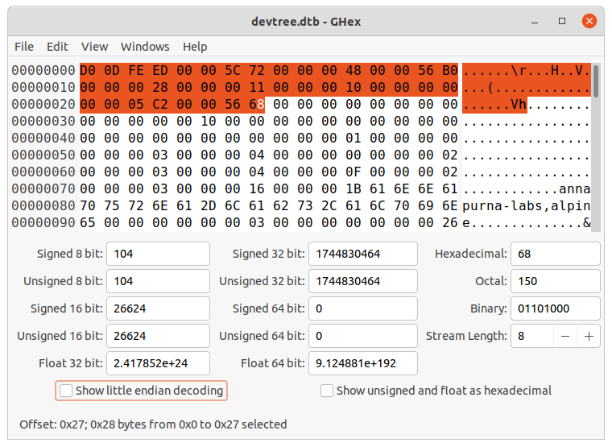
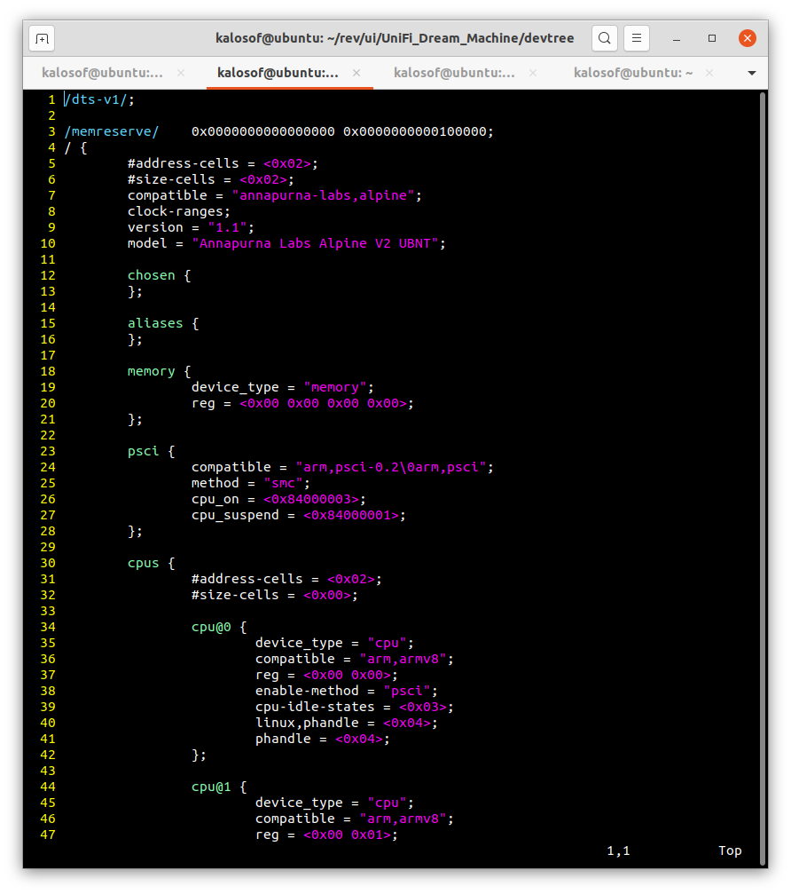

## Пара слов о devicetree, DTB, DTS

При распаковке прошивок устройств с помощью `binwalk` нередко можно встретить сигнатуру *Flattened device tree*. Мне стало любопытно что это такое, поскольку я не видел, чтобы в статьях или обзорах кто-то как-то касался этих данных. Возможно, они не представляют интереса для реверс инженера, но я не мог отделаться от стойкого ощущения неизведанного. В этой заметке мы посмотрим что же скрывается за этими тремя словами на примере одной из прошивок.

```bash
kalosof@ubuntu:~/rev/ui/UniFi_Dream_Machine$ binwalk --term 89cd-udmbase-1.5.6-7117e472b4994c3d9d8c64d053ca3e69.bin 

DECIMAL       HEXADECIMAL     DESCRIPTION
-----------------------------------------------------------------------------------------------------------------------------------------------------------------------------------------
0             0x0             Ubiquiti firmware header, header size: 264 bytes, ~CRC32: 0x3B493E07, version: "UDM.alpinev2.v1.5.6.615c4d9.200327.1930"
637           0x27D           Flattened device tree, size: 4710814 bytes, version: 17
881           0x371           gzip compressed data, has original file name: "Image", from Unix, last modified: 2020-03-27 20:36:11
4505429       0x44BF55        Flattened device tree, size: 23666 bytes, version: 17
4529733       0x451E45        Flattened device tree, size: 25607 bytes, version: 17
4555973       0x4584C5        Flattened device tree, size: 23654 bytes, version: 17
4580265       0x45E3A9        Flattened device tree, size: 25248 bytes, version: 17
4606149       0x4648C5        Flattened device tree, size: 25242 bytes, version: 17
4632025       0x46ADD9        Flattened device tree, size: 23637 bytes, version: 17
4656301       0x470CAD        Flattened device tree, size: 25582 bytes, version: 17
4682521       0x477319        Flattened device tree, size: 24472 bytes, version: 17
```

### Определение

Согласно [спецификации](https://github.com/devicetree-org/devicetree-specification/releases/tag/v0.3) devicetree - это структура данных, которая служит описанием системного оборудования и используется клиентскими приложениями. Например, при загрузке операционной системы.

### DTB

В прошивке мы имеем дело с бинарным представлением структуры *devicetree* - *Device Tree Blob (DTB)*.
Это удобно делать, если требуется передать данные ядру ОС при ее загрузке.

Скопируем DTB из прошивки в новый файл и убедимся, что данные не повреждены:

```bash
kalosof@ubuntu:~/rev/ui/UniFi_Dream_Machine$ dd if=89cd-udmbase-1.5.6-7117e472b4994c3d9d8c64d053ca3e69.bin skip=$((0x44BF55)) count=$((0x477319 - 0x44BF55)) bs=1 of=devtree.dtb

kalosof@ubuntu:~/rev/ui/UniFi_Dream_Machine/devtree$ file devtree.dtb
devtree.dtb: Device Tree Blob version 17, size=23666, boot CPU=0, string block size=1474, DT structure block size=22120

```

Заголовок DTB описывается структурой *fdt_header* и имеет вид:

```c
struct fdt_header {
	uint32_t magic;
	uint32_t totalsize;
	uint32_t off_dt_struct;
	uint32_t off_dt_strings;
	uint32_t off_mem_rsvmap;
	uint32_t version;
	uint32_t last_comp_version;
	uint32_t boot_cpuid_phys;
	uint32_t size_dt_strings;
	uint32_t size_dt_struct;
};
```

Каждое поле структуры имеет размер 4 байта и порядок big-endian.


Я не буду рассматривать каждое поле по отдельности, т.к. в этом нет острой необходимости. Подробнее о DTB можно прочитать в спецификации. Что действительно интересно - это возможность декомпиляции этих данных в читаемый вид.

### DTS

*DTS (Device Tree Source)* - это текстовое представление DTB, подобно коду на любом из компилируемых языков понятного человеку.

Для декомпиляции потребуется device-tree-decompiler:

```bash
kalosof@ubuntu:~/rev/ui/UniFi_Dream_Machine/devtree$ sudo snap install device-tree-decompiler
kalosof@ubuntu:~/rev/ui/UniFi_Dream_Machine/devtree$ dtc -I dts -O dtb -o devtree.dtb system.dts
kalosof@ubuntu:~/rev/ui/UniFi_Dream_Machine/devtree$ file system.dts
system.dts: Device Tree File (v1), ASCII text, with very long lines
```



DTS формат имеет вид дерева, имеющего директивы, узлы и свойства, определенные спецификацией. Все devicetree должны обязательно иметь узлы */cpus* и */memory*.

Если более детально посмотреть на структуру файла, то мы можем найти много интересной информации, например:
* Наличие отладочных интерфейсов - UART, JTAG.
```c
 uart0 {
    compatible = "ns16550a";
    device_type = "serial";
    reg = <0x00 0xfd883000 0x00 0x1000>;
    clock-frequency = <0x00>;
    interrupts = <0x00 0x11 0x04>;
    reg-shift = <0x02>;
    reg-io-width = <0x04>;
};
...
```
* Разметку устройств флэш-памяти, что может быть полезно при снятии дампа прошивки программатором и последующем статическом анализе кода.
```c
 nand-flash {
        compatible = "annapurna-labs,al-nand";
        reg = <0x00 0xfa100000 0x00 0x202000>;
        interrupts = <0x00 0x01 0x04>;
        clocks = <0x08>;
        clock-names = "sbclk";
        #address-cells = <0x01>;
        #size-cells = <0x01>;
        max-onfi-timing-mode = <0x01>;
        status = "disabled";
  
        partition@0 {
                label = "al_boot";
                reg = <0x00 0x200000>;
        };
  
        partition@1 {
                label = "device_tree";
                reg = <0x200000 0x100000>;
        };
  
        partition@2 {
                label = "linux_kernel";
                reg = <0x300000 0x1300000>;
        };
  
        partition@3 {
                label = "ubifs";
                reg = <0x1300000 0x1e600000>;
        };
};
spi {
            compatible = "snps,dw-spi-mmio\0snps,dw-apb-ssi";
            #address-cells = <0x01>;
            #size-cells = <0x00>;
            reg = <0x00 0xfd882000 0x00 0x1000>;
            interrupts = <0x00 0x17 0x04>;
            num-chipselect = <0x04>;
            bus-num = <0x00>;
            clocks = <0x08>;
            clock-names = "sbclk";
  
            spiflash@0 {
                    #address-cells = <0x01>;
                    #size-cells = <0x01>;
                    compatible = "spi_flash_jedec_detection";
                    spi-max-frequency = <0x23c3460>;
                    reg = <0x00>;
  
                    partition@0 {
                            reg = <0x00 0x1c0000>;
                            label = "u-boot";
                    };
  
                    partition@1 {
                            reg = <0x1c0000 0x10000>;
                            label = "u-boot-env";
                    };
                partition@2 {
                        reg = <0x1d0000 0x10000>;
                        label = "u-boot-env-2";
                };

                partition@3 {
                        reg = <0x1e0000 0x10000>;
                        label = "Factory";
                    };

                partition@4 {
                            reg = <0x1f0000 0x10000>;
                        label = "EEPROM";
                };
        };
};


```

В целом, dts-файл содержит много системной информации о целевом устройстве и его компонентах и может представлять интерес для абстрактного изучения, поиска потенциальных уязвимостей в парсерах (например, целочисленные переполнения), дальнейшего изучения спецификации и поиска уязвимостей, связанных с произвольной записью данных в разделы для этого непредназначенных. Так или иначе, одним вопросом теперь меньше.
