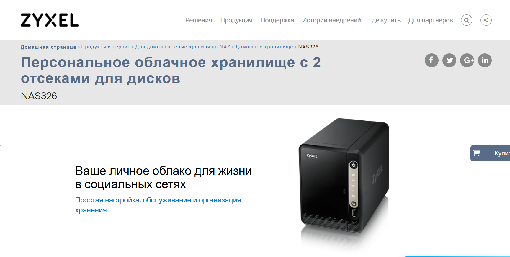
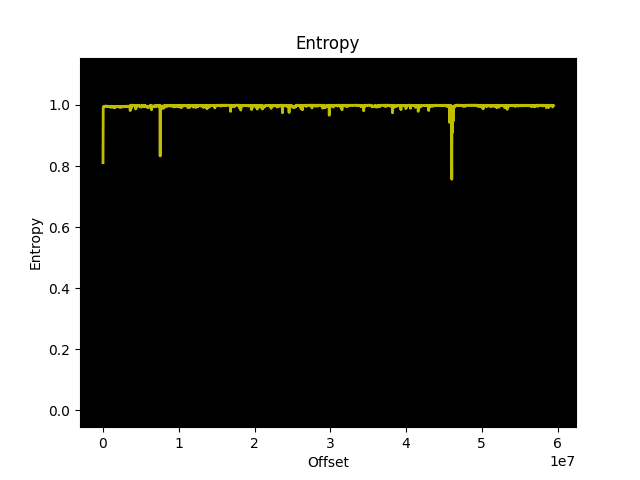

# Ковыряем Часть 1



#### Предыстория
Двенадцатого мая 2020 года в логах веб-сервера была обнаружена попытка удаленного выполнения команды ОС.
Стоит отметить, что веб-сервер не содержал уязвимой функциональности, а атака скорее всего носила массовый характер. На записи *access.log* ниже присутствует полезная нагрузка в параметре *username* скрипта *weblogin.cgi*.

```
170.247.127.186 - - [12/May/2020:16:15:33  0000] "GET /adv,/cgi-bin/weblogin.cgi?username=admin';ls #&password=asdf HTTP/1.1" 404 397 "-" "Mozilla/5.0"
```

Первичный поиск информации указывал, что уязвимость затрагивает сетевое хранилище **Zyxel NAS326**, использующий версию прошивки *V5.21(AAZF.7)C0* . Как выяснилось позже, уязвимость получила идентификатор [CVE-2020-9054](https://cve.mitre.org/cgi-bin/cvename.cgi?name=CVE-2020-9054) и присутствует в гораздо большем перечне продуктов и версий прошивок. Более подробную информацию можно узнать в заявлении на официальном сайте [производителя](https://www.zyxel.com/ru/ru/support/remote-code-execution-vulnerability-of-NAS-products.shtml).

#### Загрузка прошивки, распаковка

В качестве объекта исследования мы возьмем исправленную версию прошивки [Firmware V5.21(AAZF.7)C0](https://www.zyxel.com/ru/ru/support/download_landing/product/nas326_13.shtml?c=ru&l=ru&pid=20150327120001&tab=Firmware&pname=NAS326). После распаковки архива *NAS326_V5.21(AAZF.7)C0* мы получим три файла: 

Файл		   | Содержимое
---------------|------------------------
521AAZF7C0.bin | Файл прошивки
521AAZF7C0.pdf | Информация о релизах
NAS326_V5.21(AAZF.7)C0-foss.pdf | Лицензионное соглашение

#### Базовый анализ

В качестве базовой утилиты для анализа прошивки я буду использовать **binwalk**. Binwalk использует сигнатурный анализ файлов на предмет наличия содержимого различных форматов, позволяет распаковывать и исследовать данные: архивы, файловые системы, исполняемые файлы. Посмотрим на содержимое файла *521AAZF7C0.bin*.
Анализ энтропии свидетельствует о том, что файл вероятнее всего не зашифрован и содержит архивы данных, использующие какие-либо алгоритмы сжатия. Чаще всего можно встретить следующие: 

* LZMA
* Gzip
* Zip
* Zlib
* ARJ

```sh
kalosof@ubuntu:~/rev/nas326$ binwalk -E 521AAZF7C0.bin
```



Выполним поиск сигнатур, не распаковывая файла прошивки.
```bash
kalosof@ubuntu:~/rev/nas326$ binwalk --term --signature 521AAZF7C0.bin

DECIMAL       HEXADECIMAL     DESCRIPTION
-----------------------------------------------------------------------------------------------------------------------------------------------------------------------------------------
318           0x13E           Linux kernel ARM boot executable zImage (little-endian)
26842         0x68DA          gzip compressed data, maximum compression, from Unix, last modified: 1970-01-01 00:00:00 (null date)
7557414       0x735126        Flattened device tree, size: 12339 bytes, version: 17
7569753       0x738159        gzip compressed data, maximum compression, from Unix, last modified: 2020-02-21 05:49:42
33135921      0x1F99D31       MySQL MISAM index file Version 1
40366232      0x267F098       MySQL ISAM index file Version 5
47941000      0x2DB8588       Zip archive data, at least v2.0 to extract, compressed size: 1968, uncompressed size: 6556, name: setuptools/archive_util.py
47943024      0x2DB8D70       Zip archive data, at least v2.0 to extract, compressed size: 35966, uncompressed size: 65536, name: setuptools/cli-32.exe
47995533      0x2DC5A8D       Zip archive data, at least v2.0 to extract, compressed size: 39173, uncompressed size: 74752, name: setuptools/cli-64.exe
48082022      0x2DDAC66       Zip archive data, at least v2.0 to extract, compressed size: 35966, uncompressed size: 65536, name: setuptools/cli.exe
48167487      0x2DEFA3F       Zip archive data, at least v2.0 to extract, compressed size: 39307, uncompressed size: 75264, name: setuptools/gui-64.exe
48275922      0x2E0A1D2       Zip archive data, at least v2.0 to extract, compressed size: 37227, uncompressed size: 69120, name: setuptools/gui-arm-32.exe
48313209      0x2E13379       Zip archive data, at least v2.0 to extract, compressed size: 36047, uncompressed size: 65536, name: setuptools/gui.exe
48570299      0x2E51FBB       Zip archive data, at least v2.0 to extract, compressed size: 45934, uncompressed size: 91136, name: pip/_vendor/distlib/t32.exe
48616295      0x2E5D367       Zip archive data, at least v2.0 to extract, compressed size: 46052, uncompressed size: 94720, name: pip/_vendor/distlib/t64.exe
48793674      0x2E8884A       Zip archive data, at least v2.0 to extract, compressed size: 45176, uncompressed size: 91648, name: pip/_vendor/distlib/w64.exe
49000017      0x2EBAE51       Zip archive data, at least v2.0 to extract, compressed size: 1957, uncompressed size: 6123, name: pip/_vendor/requests/auth.py
49002032      0x2EBB630       Zip archive data, at least v2.0 to extract, compressed size: 162124, uncompressed size: 308434, name: pip/_vendor/requests/cacert.pem
59491286      0x38BC3D6       Executable script, shebang: "/bin/sh"
59491400      0x38BC448       Executable script, shebang: "/bin/sh"
59491519      0x38BC4BF       Unix path: /etc/zyxel/upnp.db  "select service from upnpinfo where service='SSH'"`
59491670      0x38BC556       Unix path: /etc/zyxel/upnp.db "insert into upnpinfo values('SSH',22,-1)"
59491792      0x38BC5D0       Unix path: /etc/zyxel/webdav/dav.flag" ] && [ $(cat /firmware/mnt/info/revision) -lt 48502 ]; then
59491890      0x38BC632       Unix path: /etc/zyxel/webdav
59491915      0x38BC64B       Unix path: /etc/zyxel/webdav/dav.flag
```

В результате выполнения команды мы можем видеть несколько интересных позиций:
* Прошивка содержит код загрузчика по смещению `0x13e`, который имеет ARM архитектуру (little endian). Загрузчик отвечает за инициализацию hardware-компонентов и передает управление ядру операционной системы.  
* По смещению `0x738159` находится архив, в который были внесены изменения 21 февраля 2020 года. Напомню, что релиз исправленной версии состоялся 24 февраля. Возможно, это как раз та область, в которую был внесен патч. Поиск различий между уязвимой и исправленной версией прошивки мог бы пролить свет на подробности патча, но я пока проигнорирую эту информацию.

Распакуем содержимое и откроем директорию *_521AAZF7C0.bin.extracted*
```bash
kalosof@ubuntu:~/rev/nas326$ binwalk -e 521AAZF7C0.bin
kalosof@ubuntu:~/rev/nas326/_521AAZF7C0.bin.extracted$ tree -r .
.
├── setuptools
│   ├── cli-32.exe
│   └── archive_util.py
├── 738159
├── 68DA
└── 2DB8588.zip
```

Наибольший интерес представляет файловая система ядра Linux *ext2*, которая находилась по смещению `0x738159`.
```bash
kalosof@ubuntu:~/rev/nas326/_521AAZF7C0.bin.extracted$ file 738159 
738159: Linux rev 1.0 ext2 filesystem data, UUID=cf8698fa-0b06-4a57-9208-bae6eb424ee8
```
Файловая система [ext2](https://ru.wikipedia.org/wiki/Ext2) по-прежнему используется на флеш-картах и твердотельных накопителях (SSD), так как отсутствие журналирования является преимуществом при работе с накопителями, имеющими ограничение на количество циклов записи. 
Примонтируем раздел на Linux-машине.
```bash
kalosof@ubuntu:~/rev/nas326/_521AAZF7C0.bin.extracted$ mkdir /mnt/nas326 && sudo mount -t ext2 738159 /mnt/nas326

kalosof@ubuntu:/mnt/nas326$ ls
bin  etc  lib  lost+found  sbin  tmp.tar.gz  usr  var
```

#### Grep и бэкдор

При анализе файловой системы стоит уделить внимание поиску следующей информации:
* Незашифрованные учетные данные
* Бэкдоры
* URL's
* Токены
* API и ключи шифрования
* Алгоримы шифрования
* Информация о используемых технологиях
* Механизмы аутентификации и авторизации

Самым простым способом поиска чувствительной информации являются стандартные для Linux-машин утилиты *strings* и *grep*.
Степень вовлеченности в процесс зависит от самого исследователя. Зачастую файловая система представляет большой объем данных, содержащий как стандартный набор файлов и утилит, специфичных для Linux, так и сторонние библиотеки и ПО.

```bash
kalosof@ubuntu:/mnt/nas326$ grep -ri "backdoor" .
Binary file ./usr/lib/python2.7/hmac.pyc matches
Binary file ./usr/local/apache/cgi-bin/remote_help-cgi matches
./usr/local/btn/open_back_door.sh:BACKDOOR_KEY=`/sbin/makekey`
./usr/local/btn/open_back_door.sh:BACKDOOR_PWD=`/sbin/makepwd $BACKDOOR_KEY`
./usr/local/btn/open_back_door.sh:echo $BACKDOOR_PWD | sed -e 's/\//\\\//g' > /tmp/wkdhfwe0f9e9fujfkef
./usr/local/btn/open_back_door.sh:BACKDOOR_PWD=`cat /tmp/wkdhfwe0f9e9fujfkef`
./usr/local/btn/open_back_door.sh:cat /etc/shadow.bak  | sed -e 's/^NsaRescueAngel\:[^\:]*\:/NsaRescueAngel:'$BACKDOOR_PWD':/g'> /etc/shadow
./usr/local/btn/open_back_door.sh:	echo "[BackdoorOpen] telnet daemon is NOT running."
./usr/local/btn/open_back_door.sh:	echo "[BackdoorOpen] telnet daemon is running."
./usr/local/btn/open_back_door.sh:	echo "[BackdoorOpen] backdoor monitor daemon is NOT running."
./usr/local/btn/open_back_door.sh:	echo "[BackdoorOpen] backdoor monitor daemon is running."
grep: ./lost+found: Permission denied
./etc/init.d/rcS2:#sshd backdoor
```

Поиск по ключевому слову "backdoor" вернул несколько совпадений. Откроем скрипт `./usr/local/btn/open_back_door.sh` в текстовом редакторе.

```bash
#!/bin/sh
BACKDOOR_KEY=`/sbin/makekey`
BACKDOOR_PWD=`/sbin/makepwd $BACKDOOR_KEY`

echo $BACKDOOR_PWD | sed -e 's/\//\\\//g' > /tmp/wkdhfwe0f9e9fujfkef
BACKDOOR_PWD=`cat /tmp/wkdhfwe0f9e9fujfkef`

IS_SERVERBOX=`mrd_fbits | grep ^"D9 01"`
IS_STG220=`mrd_fbits | grep ^"DE 01"`
cp /etc/shadow /etc/shadow.bak
cat /etc/shadow.bak  | sed -e 's/^NsaRescueAngel\:[^\:]*\:/NsaRescueAngel:'$BACKDOOR_PWD':/g'> /etc/shadow
rm -f /etc/shadow.bak

#sshd
if [ "${1}" == "sshd" ]; then
	chmod 0700 /etc/ssh/*
	start-stop-daemon -b -S -N 5 -x /sbin/sshd -- -p 22
	exit 0
fi
DaemonRunning=`ps | grep "/sbin/telnetd" | grep -v "grep"`

if [ "${DaemonRunning}" == "" ]; then
	echo "[BackdoorOpen] telnet daemon is NOT running."
	/sbin/telnetd
else
	echo "[BackdoorOpen] telnet daemon is running."
fi

DaemonRunning=`ps | grep "/sbin/monitord" | grep -v "grep"`
if [ "${DaemonRunning}" == "" ]; then
	echo "[BackdoorOpen] backdoor monitor daemon is NOT running."
	/sbin/start-stop-daemon -b -S -N 5 -x /sbin/monitord
else
	echo "[BackdoorOpen] backdoor monitor daemon is running."
fi
```

В результате работы скрипта происходит следующее (детали опущены для краткости):
* Утилита `/sbin/makekey` возвращает ключ шифрования и сохраняет его в переменной `BACKDOOR_KEY`
* Переменная `BACKDOOR_PWD` формируется из результата выполнения утилиты `/sbin/makepwd` с ключем `BACKDOOR_KEY` в качестве параметра.
* Пароль сохраняется в файле директории `/tmp/wkdhfwe0f9e9fujfkef`, переменная `BACKDOOR_PWD` переопределяется с этим значеним
* Для пользователя `NsaRescueAngel` перезаписывается хэш пароля в файле `/etc/shadow`
* Если сервис `/sbin/telnetd` отсутствует в списке запущенных процессов, то происходит его запуск.
* Если сервис `/sbin/monotord` отсутствует в списке запущенных процессов, то происходит его запуск

Здесь наибольший интерес представляют утилиты, отвечающие за генерацию ключа и хэша пароля для доступа к шеллу по протоколу *telnet*. Зачастую для `/etc/shadow` используется алгоритм sha512, но также могут быть использованы *md5*, *Blowfish*, *sha256*.

Название утилиты makepwd похоже на [makepasswd](https://manpages.debian.org/stretch/makepasswd/makepasswd.1.en.html), которую можно установить через пакетный менеджер в Linux. Возможно, мы имеем дело с ее урезанной версией. Описание утилиты makekey можно найти на сайте проекта [opennet](https://www.opennet.ru/man.shtml?topic=makekey&category=1&russian=4).

##### Update
Уже после того, как я запустил дизассемблер, то решил еще немного "покопать" и наткнулся на интересную информацию об этом "[бэкдоре](http://web.archive.org/web/20190403131345/http://zyxel.nas-central.org/wiki/Telnet_backdoor)".

Документ подробно описывает алгоритм, который совпадает с тем, что мы видели в исходном коде. Скрипт бэкдора запускается через веб-интерфейс (*требует права администратора*), makekey генерирует пароль от **MAC-адреса** устройства и возвращает его пользователю.
Пользователь подключается по `telnet` с этим паролем под учетной записью `NsaRescueAngel`, который имеет root-права. Встает вопрос, можем ли мы узнать пароль, если знаем MAC-адрес устройства, и получить контроль над устройством? К сожалению, я не располагаю физическим устройством, чтобы проверить доступность этой функциональности на последних версиях прошивки. Динамический анализ исполняемых файлов ARM, MIPS архитектур при помощи qemu я оставлю для последующих частей. 

Также я обнаружил еще одну файловую систему, которая находилась по смещению `0x68DA`, которую *binwalk* идентифицировал как gzip-архив. После распаковки содержимого мы можем видеть типичную для Linux иерархию файлов (*rootfs*).
```bash
kalosof@ubuntu:~/rev/nas326/_521AAZF7C0.bin.extracted/_68DA.extracted$ ls
84013B  84013B.7z  845958.cpio  cpio-root  E79ECF  E79ECF.7z
kalosof@ubuntu:~/rev/nas326/_521AAZF7C0.bin.extracted/_68DA.extracted$ cd cpio-root/
kalosof@ubuntu:~/rev/nas326/_521AAZF7C0.bin.extracted/_68DA.extracted/cpio-root$ ls
bin  dev  e-data  etc  firmware  home  i-data  init  lib  linuxrc  mnt  proc  ram_bin  root  sbin  sys  tmp  usr  var
kalosof@ubuntu:~/rev/nas326/_521AAZF7C0.bin.extracted/_68DA.extracted/cpio-root$ 
```

Файл `/etc/shadow` содержит зашифрованные пароли пользователей. В данном случае *root* и *admin* имеют одинаковые хэши и пароли соответственно. Также присутствует пользователь *NsaRescueAngel*, который пока что не имеет пароля и не может быть использован для подключения по *telnet*.

```bash
kalosof@ubuntu:~/rev/nas326/_521AAZF7C0.bin.extracted/_68DA.extracted/cpio-root$ cat etc/shadow
root:$1$$iC.dUsGpxNNJGeOm1dFio/:13013:0:99999:7:::
NsaRescueAngel:!!:13493:0:99999:7:::
bin:*:13013:0:99999:7:::
daemon:*:13013:0:99999:7:::
adm:*:13013:0:99999:7:::
lp:*:13013:0:99999:7:::
sync:*:13013:0:99999:7:::
shutdown:*:13013:0:99999:7:::
halt:*:13013:0:99999:7:::
mail:*:13013:0:99999:7:::
news:*:13013:0:99999:7:::
uucp:*:13013:0:99999:7:::
operator:*:13013:0:99999:7:::
games:*:13013:0:99999:7:::
gopher:*:13013:0:99999:7:::
ftp:*:13013:0:99999:7:::
nobody:*:13013:0:99999:7:::
rpc:!!:13013:0:99999:7:::
rpcuser:!!:13013:0:99999:7:::
nfsnobody:!!:13013:0:99999:7:::
pcap:!!:13013:0:99999:7:::
apache:!!:13013:0:99999:7:::
xfs:!!:13013:0:99999:7:::
ntp:!!:13013:0:99999:7:::
nut:!!:13013:0:99999:7:::
ldap:!!:13013:0:99999:7:::
mysql:!!:13013:0:99999:7:::
sysinit:!!:13013:0:99999:7:::
avahi:!!:13013:0:99999:7:::
admin:$1$$iC.dUsGpxNNJGeOm1dFio/:13013:0:99999:7:::
password:!!:5044:0:99999:7:::
pc-guest:*:13013:0:99999:7:::
anonymous-ftp:*:13013:0:99999:7:::
sshd:!!:13013:0:99999:7:::
```

John быстро справился с подбором  паролей для пользователей *root* и *admin*. Учетная запись `admin:1234` является дефолтной для доступа к панели администратора устройства.

```bash
kalosof@ubuntu:~/rev/nas326/_521AAZF7C0.bin.extracted/_68DA.extracted/cpio-root$ john --fork=4 etc/shadow
Loaded 2 password hashes with no different salts (md5crypt [MD5 32/64 X2])
Node numbers 1-4 of 4 (fork)
Press 'q' or Ctrl-C to abort, almost any other key for status
1234             (admin)
1234             (root)

kalosof@ubuntu:~/rev/nas326/_521AAZF7C0.bin.extracted/_68DA.extracted/cpio-root$ john --show etc/shadow
root:1234:13013:0:99999:7:::
admin:1234:13013:0:99999:7:::

2 password hashes cracked, 0 left

```


