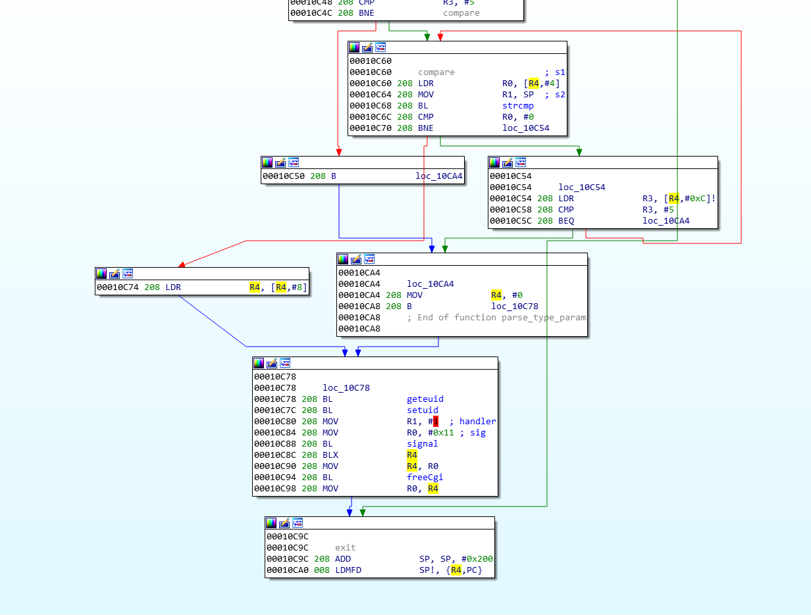
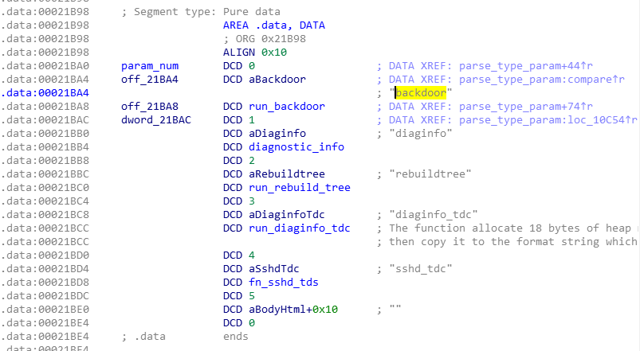
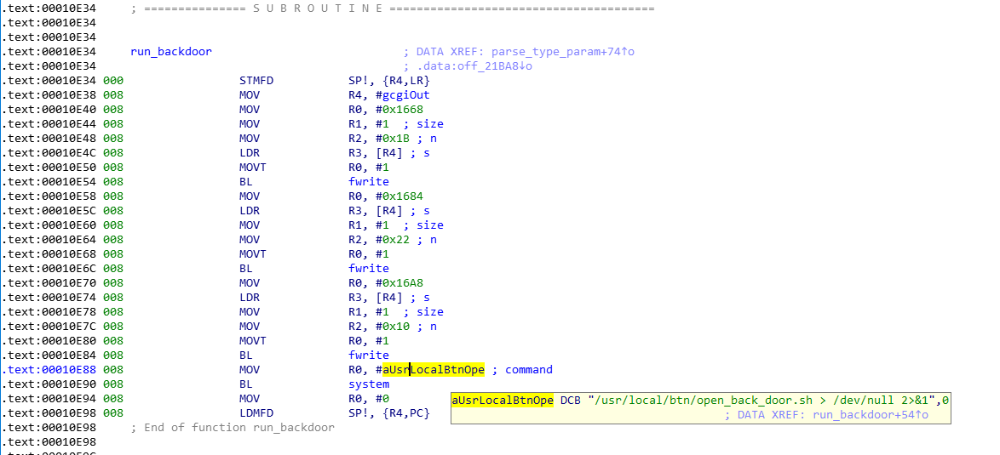

# Ковыряем Часть 2

В предыдущей части мы обнаружили бэкдор в виде bash-скрипта `open_back_door.sh`, который генерировал пароль и хэш пароля с его последующей записью в файл *shadow* для пользователя `NsaRescueAngel`.
Данная учетная запись используется в дальнейшем для удаленного подключения по протоколу *telnet* с root-привилегиями. 

В этой части мы проанализируем бинарный файл `remote_help_cgi`, который используется для запуска скрипта из веб-интерфейса, а также проэмулируем `makekey` и `makepwd` при помощи qemu для ARM.

#### Сведения о файле

Файл `remote_help_cgi`, как и все исполняемые файлы прошивки представляет собой исполнямый ELF под ARM 32-bit, слинкованный динамически (импортирует библиотечные вызовы функций) и прошедший через утилиту *strip* т.е. в файле отсутствуют отладочные символы.

```bash
kalosof@iotlab:~/Documents/firmwares/nas326/_521AAZF7C0.bin.extracted/rootf/usr/local/apache/cgi-bin$ file remote_help-cgi 
remote_help-cgi: ELF 32-bit LSB executable, ARM, EABI5 version 1 (SYSV), dynamically linked, interpreter /lib/ld-linux-armhf.so.3, for GNU/Linux 2.6.32, stripped
```

Собственно, мы можем посмотреть на таблицу символов и убедиться в том, что дополнительная информация о именах функций отсутствует.

```bash
kalosof@iotlab:~/Documents/firmwares/nas326/_521AAZF7C0.bin.extracted/rootf/usr/local/apache/cgi-bin$ readelf --symbols remote_help-cgi 

Symbol table '.dynsym' contains 53 entries:
   Num:    Value  Size Type    Bind   Vis      Ndx Name
     0: 00000000     0 NOTYPE  LOCAL  DEFAULT  UND 
     1: 00000000     0 FUNC    GLOBAL DEFAULT  UND __getdelim@GLIBC_2.4 (2)
     2: 00000000     0 FUNC    GLOBAL DEFAULT  UND strcmp@GLIBC_2.4 (2)
     3: 00000000     0 FUNC    GLOBAL DEFAULT  UND gcgiSetLimits
     4: 00000000     0 NOTYPE  WEAK   DEFAULT  UND _ITM_deregisterTMCloneTab
     5: 00021be8     0 NOTYPE  GLOBAL DEFAULT   23 __bss_start__
     6: 00000000     0 FUNC    GLOBAL DEFAULT  UND fopen@GLIBC_2.4 (2)
     7: 00000000     0 FUNC    GLOBAL DEFAULT  UND gcgiSendContentDisp
     8: 00000000     0 FUNC    GLOBAL DEFAULT  UND free@GLIBC_2.4 (2)
     9: 00000000     0 FUNC    GLOBAL DEFAULT  UND fgets@GLIBC_2.4 (2)
    10: 00021bf0     0 NOTYPE  GLOBAL DEFAULT   23 _bss_end__
    11: 00021be8     0 NOTYPE  GLOBAL DEFAULT   22 _edata
    12: 00000000     0 FUNC    GLOBAL DEFAULT  UND signal@GLIBC_2.4 (2)
    13: 00000000     0 FUNC    GLOBAL DEFAULT  UND time@GLIBC_2.4 (2)
    14: 000115dc     0 FUNC    GLOBAL DEFAULT   13 _fini
    15: 00021bf0     0 NOTYPE  GLOBAL DEFAULT   23 __bss_end__
    16: 00000000     0 FUNC    GLOBAL DEFAULT  UND unlink@GLIBC_2.4 (2)
    17: 00021bec     4 OBJECT  GLOBAL DEFAULT   23 gcgiOut
    18: 00000000     0 FUNC    GLOBAL DEFAULT  UND geteuid@GLIBC_2.4 (2)
    19: 00000000     0 FUNC    GLOBAL DEFAULT  UND __xstat@GLIBC_2.4 (2)
    20: 00000000     0 FUNC    GLOBAL DEFAULT  UND fwrite@GLIBC_2.4 (2)
    21: 00000000     0 FUNC    GLOBAL DEFAULT  UND strcpy@GLIBC_2.4 (2)
...
```

К слову, утилиту readelf можно использовать для поиска потенциально уязвимых и/или опасных функций, например `system, sprintf, strstr, memcpy, strcpy` и т.д, используя поиск по символам на этапе первичного анализа.

#### Немного реверса

В дизассемблере наибольший интерес представляют функции `sub10C00` и `sub10E34`. Первая - это на самом деле `main` функция, которую я переименовал для удобства восприятия на `parse_type_param`, а вторую на `run_backdoor` соответственно.

Функция `parse_type_param` начинается и заканчивается функциями `initCgi` и `freeCgi`, которые осуществляют обработку HTTP-запросов. Исходный код библиотеки я нашел в [открытом доступе](https://github.com/jbouse-debian/libgcgi).

Далее происходит сравнение значения параметра `type` со строкой `backdoor` и если условие истино, то происходит переход по смещению функции `run_backdoor`. 


Помимо функции `run_backdoor` есть еще несколько служебных функций, но в данном случае они не представляют интереса.



Сама функция не представляет из себя ничего сверхъестественного и отвечает за вывод результата выполнения функции `system` на экран пользователя. В качестве параметра в функцию передается уже знакомый скрипт бэкдора.



#### QEMU

Для эмуляции исполняемых файлов под ARM нам потребуется qemu. В качестве экспериментов я использую Ubuntu 18.04 и дальнейшие инструкции будут справедливы для этой версии ОС.

```bash
sudo apt install qemu
sudo apt install -y qemu-user-static 
```

Далее копируем `qemu-user-static` в корень извлеченной ранее файловой системы и проверяем работоспособность.
```bash
kalosof@iotlab:~/Documents/firmwares/nas326/_521AAZF7C0.bin.extracted/_68DA.extracted/cpio-root$ cp $(which qemu-arm-static) .
kalosof@iotlab:~/Documents/firmwares/nas326/_521AAZF7C0.bin.extracted/_68DA.extracted/cpio-root$ sudo chroot . ./qemu-arm-static ./bin/busybox sh


BusyBox v1.19.4 (2020-02-21 10:23:51 CST) built-in shell (ash)
Enter 'help' for a list of built-in commands.

/ # 

```

Как уже упоминалось ранее, сначала мы должны запустить `makekey` без флага. На листинге ниже мы можем видеть несколько опций. 

```
kalosof@iotlab:~/Documents/firmwares/nas326/_521AAZF7C0.bin.extracted/_68DA.extracted/cpio-root$ sudo chroot . ./qemu-arm-static ./bin/makekey -h
Usage: ./bin/makekey [options] [<mac_address>]
Available options are:
  -e, --encrypt           Encrypt key for /etc/passwd
  -?, -h, --help          Print this message
  -v, --version           Show version

<mac_address>             MAC address of the device
                          If not presented, the program uses MAC from eth0. 
```

Поскольку бэкдор не использует никаких аргументов, то для генерации ключа будет использоваться MAC-адрес интерфейса **eth0**. Возможно, это реализуется через парсинг вывода ifconfig. Для теста используем произвольное значение соответствующего формата.

```bash
kalosof@iotlab:~/Documents/firmwares/nas326/_521AAZF7C0.bin.extracted/_68DA.extracted/cpio-root$ sudo chroot . ./qemu-arm-static ./bin/makekey  00:11:22:33:44:55
4cajZKRF
```

Итак, мы сгенерировали пароль `4cajZKRF`. Стоит отметить, что пароль генерируется каждый раз один и тот же, чего не происходит при использовании флага `-e`. Возможно, за этим флагом скрывается какой-то RNG.

Далее, вызовем утилиту `makepwd` с этим паролем.

```bash
kalosof@iotlab:~/Documents/firmwares/nas326/_521AAZF7C0.bin.extracted/_68DA.extracted/cpio-root$ sudo chroot . ./qemu-arm-static ./bin/makepwd 4cajZKRF
$1$$lte1OpWA09UfP7kZrQheG1
```

Результатом выполнения команды является статичный md5-хэш без соли. 
